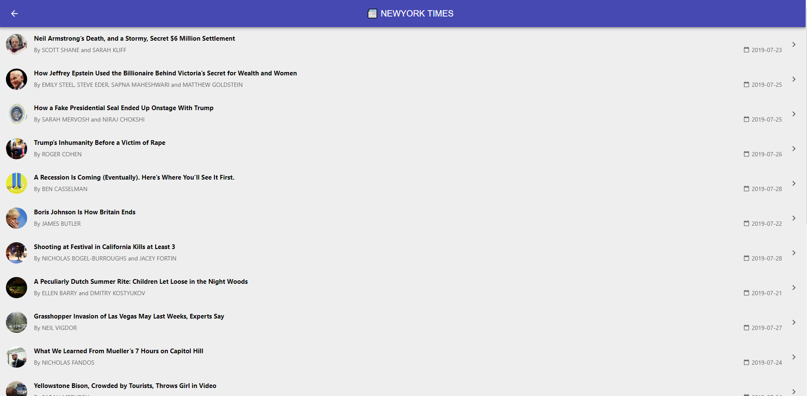

# New-York-Times-Latest
New York Times Info uses NYTimes most viewed section API.

Features:

- Lighter builds with React Hooks (Total build is <60kb)
- React.lazy + dynamic import
- Material UI React
- Testing with Jest Framework
- React Testing Library
- Code Splitting
- SCSS Preprocessor
- Making a Progressive Web App

## Getting Started

```sh
npm run dev
```

## Building for Production

```sh
npm run start
```

## Demo

[here](https://stupefied-sinoussi-7a41d5.netlify.com/)

## Desktop App



## Mobile App


### Recommendations

If you're new to using React Hooks, Please Refer [here](https://reactjs.org/docs/hooks-intro.html)